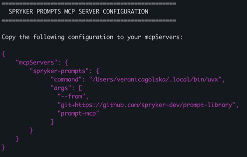

# 🚀 Spryker Prompt Library Integration

## What is MCP (Model Context Protocol)?
https://modelcontextprotocol.io/docs/getting-started/intro

## Overview
We provide two ways to integrate the Spryker Prompt Library with your AI development workflow:

1. **MCP Server Integration** - AI assistant accesses prompts through MCP server
2. **Hashtag Integration** - Auto-load prompts using the intelligent `#prompts` hashtag

Choose the approach that best fits your needs.

---

## Option 1: MCP Server Integration

A guide to quickly start using the Spryker Prompts MCP server.

> ⚠️ **Important**: MCP server usage can consume additional credits during operation. Consider disabling the server when not actively using prompts to avoid unnecessary credit usage.

### Quick Start

A quick guide to set up and use the Spryker Prompts MCP (Model Context Protocol) server with your IDE.

#### 🚀 Step 1: Install with Script

Run our automated setup script to install dependencies and generate your configuration:

```bash
sh <(curl -s https://raw.githubusercontent.com/spryker-dev/prompt-library/main/bin/setup-prompt-mcp)
```

This script will:
- ✅ Install `uv` if not already present
- ✅ Detect the correct paths automatically
- ✅ Generate ready-to-use MCP configuration
- ✅ Test the installation

#### 📋 Step 2: Copy Configuration to IDE Settings

After running the script, you'll see a configuration like this:




**Copy the configuration from terminal command output and add it to your IDE's MCP settings.**

##### Where to Add Configuration:

| IDE/Tool | Configuration Location | Configuration Key | Setup Guide |
|----------|----------------------|-------------------|-------------|
| Claude Desktop | Settings → MCP Servers | `mcpServers` | - |
| Windsurf | Settings → MCP | `mcpServers` | [MCP Setup Guide](ide_setup/windsurf-setup.md#mcp-servers-setup) |
| Cursor | Settings → Tools & Integrations | `mcpServers` | [MCP Setup Guide](ide_setup/cursor-setup.md#mcp-servers-setup) |
| VS Code + GitHub Copilot | Extension Settings / .vscode/mcp.json | `servers` | [MCP Setup Guide](ide_setup/vscode-setup.md#mcp-servers-setup) |
| Other IDEs | Check IDE documentation | Varies | - |

> **Important**: Some IDEs use different configuration keys. If `mcpServers` doesn't work, try `servers` or check your IDE's documentation.

##### 🔗 Resources

- [Spryker Prompt Library Repository](https://github.com/spryker-dev/prompt-library)
- [uv Installation Guide](https://docs.astral.sh/uv/#installation)
- [Model Context Protocol Documentation](https://modelcontextprotocol.io/)

##### 💡 Tips

- **First Run**: The first time you use the server, it may take a moment to download dependencies
- **Credit Management**: MCP server usage may consume additional credits - consider disabling when not in use
- **Updates**: Restart the MCP server periodically to get the latest prompts
- **Team Sharing**: Save your configuration file to share with team members
- **Path Issues**: Always use the full path to `uvx` or `uv` as provided by the script

##### ⚠️ Configuration Not Working?

##### Different Configuration Keys
If your IDE doesn't recognize `mcpServers`, try these alternatives:
- `mcp-server`
- `mcpConfig`
- `servers`

##### Common Issues
- **Wrong Key**: Replace `mcpServers` with your IDE's expected key
- **JSON Syntax**: Ensure no trailing commas and proper quotes
- **Path Problems**: Verify the command path is correct and executable
- **Permissions**: Make sure the `uvx`/`uv` binary has execute permissions

##### 🧪 Testing Your Setup

To verify your MCP server is working:

1. **Restart your IDE** after adding the configuration
2. **Check Server List**: Look for "spryker-prompts" in your MCP servers list
3. **Access Prompts**: Try browsing available prompts through your IDE interface
4. **Test a Prompt**: Run a simple prompt to ensure it's working

##### Quick Test
If your IDE supports it, you should see:
- ✅ Spryker Prompts server listed as connected
- ✅ Available prompts in the prompt library
- ✅ Ability to execute prompts successfully

##### Still Not Working?
1. **Re-run the setup script** to verify installation
2. **Check the [repository issues](https://github.com/spryker-dev/prompt-library/issues)** for known problems
3. **Create a new issue** with your specific error message and IDE details

---

#### How to use:
For example, you want to generate some module with spryker-prompt mcp.
For a better experience we recommend adding `Use spryker prompts` to the end of the prompt.

```text
Please give me a prompt to implement a customer data import module with basic fields. Use spryker prompts.
```
Agent will return a prompt from mcp and modify it to fit your needs.

```text
Please implement a customer data import module with basic fields. Use spryker prompts.
```
Agent will implement module using a prompt from mcp.


### Benefits

✅ **Intelligent discovery** - AI finds relevant prompts automatically \
✅ **Semantic matching** - No need to remember specific tags \
✅ **Real-time access** - Direct integration with MCP-compatible assistants \
✅ **Dynamic adaptation** - Prompts contextually modified for your needs \

### Upgrade package
Run the command.
```shell
uvx --from git+https://github.com/spryker-dev/prompt-library prompt-mcp
```
Wait until the command is finished. It should look like this:
```text
uvx --from git+https://github.com/spryker-dev/prompt-library prompt-mcp
Updated https://github.com/spryker-dev/prompt-library (d2b45720795cd18522a2bd07045915def1c13d41)
Built prompt-library @ git+https://github.com/spryker-dev/prompt-library@d2b45720795cd18522a2bd07045915def1c13d41
Installed 34 packages in 47ms
```

---

## Option 2: Hashtag Integration

Auto-load expert prompts using the intelligent #prompts hashtag. Instead of copy-pasting prompts or remembering specific tags, just type #prompts and the AI automatically analyzes your request to select and apply the most relevant prompt.

> **Multi-editor support:** This system works with Windsurf, Cursor, GitHub Copilot, and other AI assistants.

### Setup

#### Automatic Setup (Recommended)
Navigate to your project directory:
```bash
cd your-project-directory
```
Run the setup script:
```bash
bash <(curl -s https://raw.githubusercontent.com/spryker-dev/prompt-library/main/bin/setup-project)
```

#### Manual Setup
If you prefer manual installation:

```bash
# 1. Add as git submodule
git submodule add https://github.com/spryker-dev/prompt-library ai-prompts

# 2. Generate tags mapping
bash ai-prompts/bin/generate-tags
```

Both methods will:
- Add prompt library as git submodule in ai-prompts/
- Generate prompt-tags.json with available tags

#### Configure AI Assistant Rules
Choose your AI editor and follow the corresponding setup:

| IDE/Tool | Setup Guide |
|----------|-------------|
| Windsurf | [AI Rules Setup Guide](ide_setup/windsurf-setup.md#ai-rules) |
| Cursor | [AI Rules Setup Guide](ide_setup/cursor-setup.md#ai-rules) |
| VS Code + GitHub Copilot | [AI Rules Setup Guide](ide_setup/vscode-setup.md#ai-rules) |
| PhpStorm + GitHub Copilot | Settings → Languages & Frameworks → GitHub Copilot → Custom Instructions |

**Copy the following AI Assistant Rules content to the location specified in your IDE's setup guide above:**

**📋 START COPY FROM HERE**

# AI Assistant Rules for Prompt Library Integration

```markdown
## Intelligent Prompt Discovery with #prompts Tag

When you encounter the #prompts hashtag in user messages:

1. Analyze the request context: Understand what the user is trying to accomplish
2. Load available prompts: Read prompt-tags.json in ai-prompts submodule to see all available prompts
3. Smart selection process:
   - If context clearly matches one prompt → Load and apply it automatically
   - If multiple prompts could be relevant → Ask user to choose from 2-3 best options
   - If no clear match → Suggest closest alternatives or ask for clarification
4. Apply the selected prompt: Load content from the chosen prompt file and incorporate into your response

## Key Principles

- One tag to rule them all - #prompts is the only tag developers need to remember
- Context-aware selection - Analyze the request to find the most relevant prompt(s)
- Intelligent assistance - When uncertain, offer choices rather than guessing wrong
- Natural integration - Apply prompts organically within your normal workflow
- Preserve your intelligence - Use prompts to enhance, not replace your analysis
- Keep your natural behavior - explore project structure, analyze patterns, ask clarifying questions
- Enhance, don't replace - use prompts to enrich your knowledge, not override your intelligence
- Stay contextual - adapt prompts to the specific project and user needs
- Be organic - no robotic announcements, just better-informed responses

## Implementation

- Prompts are templates and guidelines, not rigid scripts
- Your natural project exploration and analysis approach is valuable - keep it
- Use #prompts as a trigger for intelligent prompt selection, not commands to follow blindly
- Combine prompt knowledge with your understanding of the current project
- When multiple prompts could apply, present options rather than guessing
- Maintain your contextual approach to problem-solving

## Selection Logic Examples

Clear match:
User: "Create data import module for Product entity #prompts"
→ Auto-select data-import prompt (obvious match)

Multiple options:
User: "Help me write tests for my service #prompts"
→ Ask: "I found several testing prompts. Which type do you need:
   1. Unit tests with data providers
   2. Integration tests
   3. End-to-end tests?"

No clear match:
User: "Optimize my database queries #prompts"
→ "I don't have specific database optimization prompts. The closest I have are:
   - Propel schema generator
   - Performance review guidelines
   Would either of these help, or do you need something else?"

## Technical Details

How to use the mapping:
1. Read prompt-tags.json in ai-prompts submodule to get all available prompts
2. Analyze user request context against prompt descriptions/names/tags
3. Select best match(es) using semantic understanding
4. Load actual prompt content from ai-prompts/prompts/[category]/[filename].md
5. Apply prompt knowledge naturally to the user's specific request
6. Values can be strings (single prompt) or arrays (multiple prompts to choose from)

File structure:
- Mapping: prompt-tags.json (ai-prompts submodule)
- Prompts: ai-prompts/prompts/[category]/[filename].md

## File Location

- Prompt mapping: prompt-tags.json (ai-prompts submodule)
```

This intelligent system eliminates the need to remember specific tags while maintaining precision through AI-assisted selection and preserving your natural, contextual approach to problem-solving.

### Usage Examples

**Example 1: Specific module creation**
```
Create data-import module for Review entity #prompts
```
*AI will analyze the context and automatically select the appropriate data-import prompt to generate the complete module.*

**Example 2: Testing prompts**
```
Help me write tests #prompts
```
*AI will show available testing prompt options:*
- Unit tests with data providers
- Integration tests
- End-to-end tests

### Find Available Tags

```bash
# See all available tags
cat ai-prompts/prompt-tags.json | jq -r 'keys[]' | sed 's/^/#/'

# Or just look at the keys
grep '".*":' ai-prompts/prompt-tags.json
```

### How It Works

1. Setup adds prompt library as git submodule and generates tag mapping
2. You add AI rules to settings
3. AI detects #prompts and analyzes your request context
4. AI selects best matching prompt(s) or asks for clarification
5. Selected prompt is applied to your request automatically

### Benefits

✅ **One tag only** - just remember #prompts \
✅ **Intelligent selection** - AI picks the right prompt for you \
✅ **Always current** - auto-generated from prompts \
✅ **Team consistency** - same prompts for everyone \
✅ **Fast development** - no copy-paste needed \

### Update

```bash
# Update prompt library to latest version
git submodule update --remote ai-prompts
bash ai-prompts/bin/generate-tags
```

That's it! 🎯
