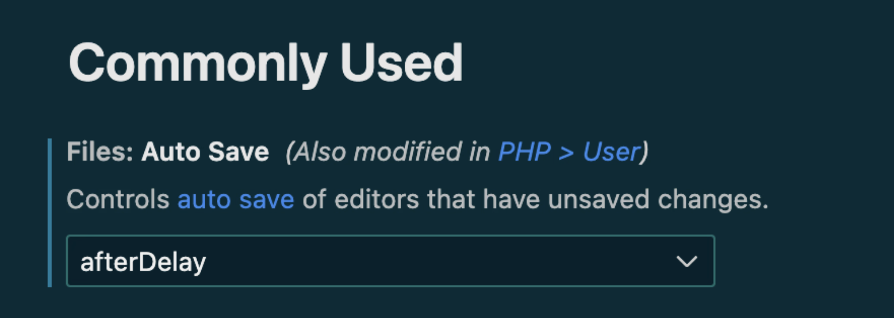
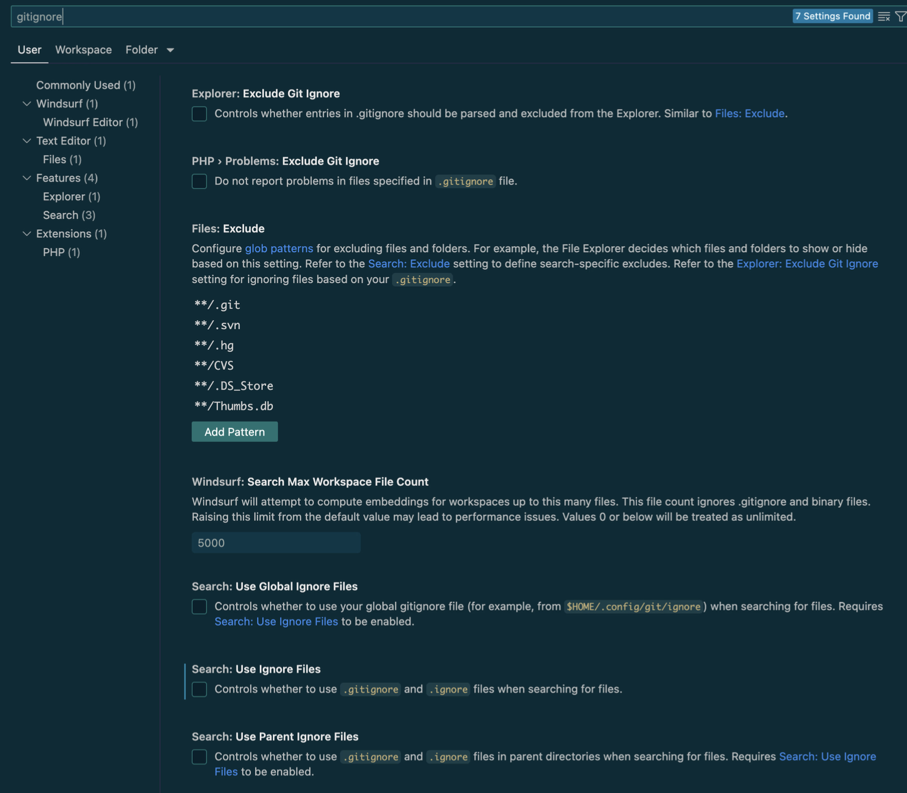
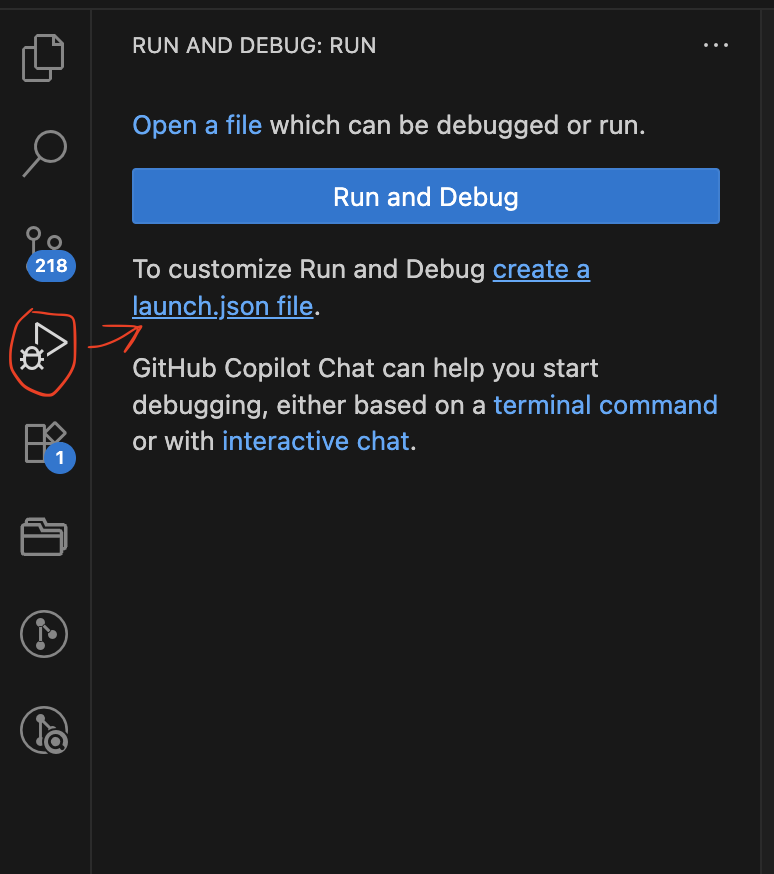
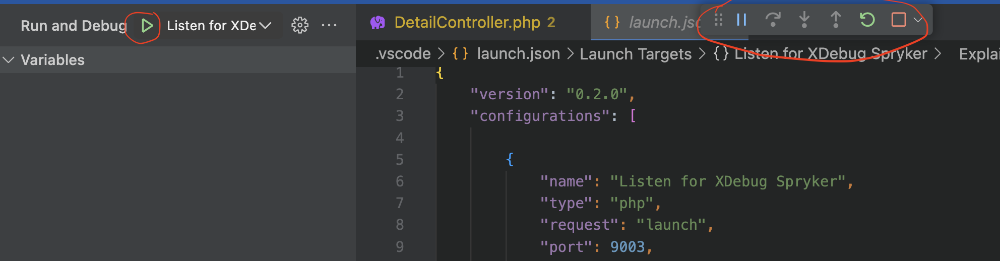
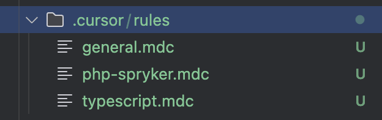
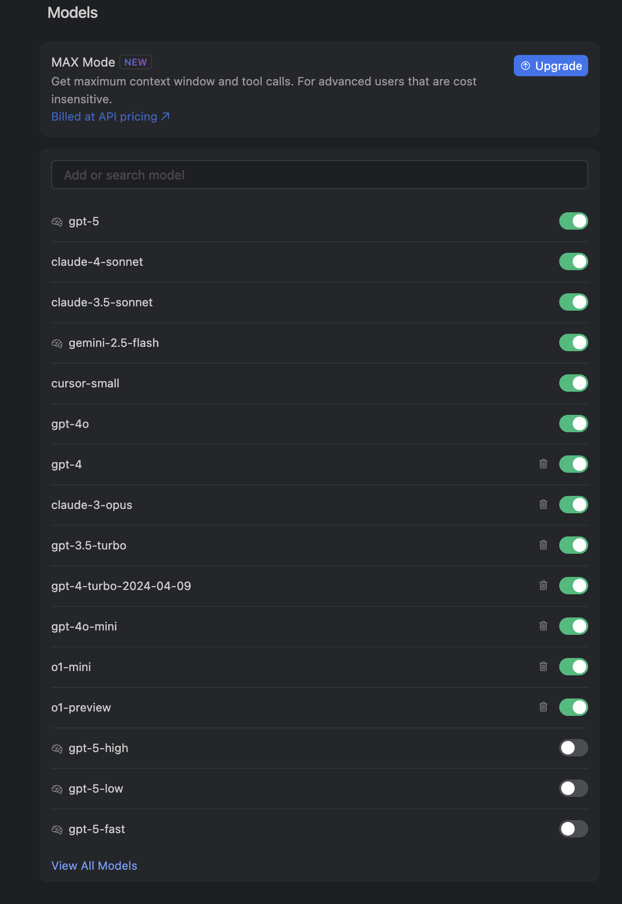
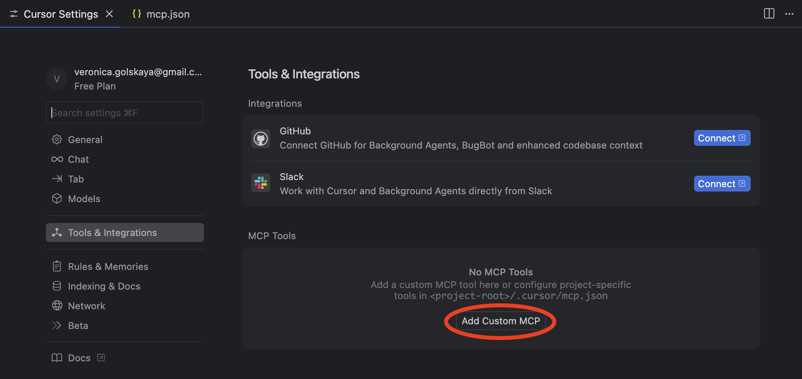
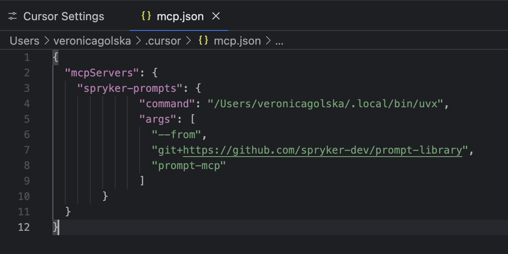
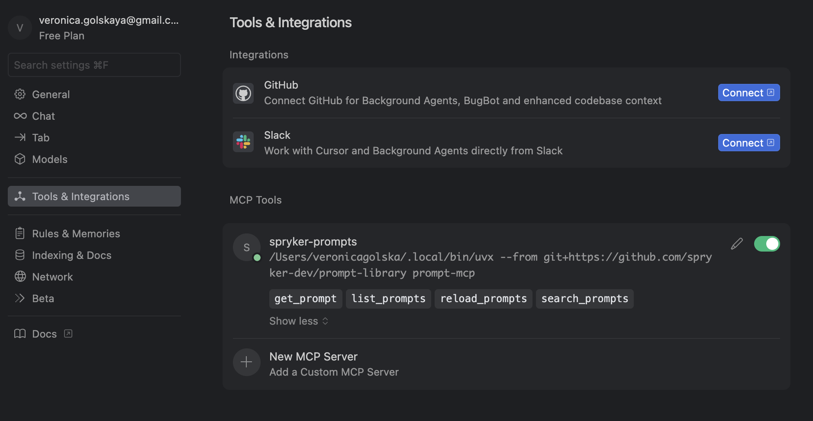

# How to Set Up Cursor for Backend Development

## Table of Contents

1. [Install Cursor](#1-install-cursor)
2. [Install Recommended Extensions](#2-install-recommended-extensions)
   - [Development](#development)
   - [Git & Database](#git--database)
   - [Familiar Shortcuts](#familiar-shortcuts)
3. [Configure Basic Options](#3-configure-basic-options)
4. [Set Up PHP Debugging](#4-set-up-php-debugging)
5. [AI Configuration for Efficient Development](#5-ai-configuration-for-efficient-development)
   - [AI Rules](#ai-rules)
   - [Models Configuration](#models-configuration)
   - [MCP Servers Setup](#mcp-servers-setup)

## 1. Install Cursor

**Cursor**: https://www.cursor.com/

## 2. Install Recommended Extensions

### Development

- **PHP Tools** - https://marketplace.visualstudio.com/items?itemName=DEVSENSE.phptools-vscode
- **PHP Debug** - https://marketplace.visualstudio.com/items?itemName=felixfbecker.php-debug
- **PHP Intelephense** - https://marketplace.visualstudio.com/items?itemName=bmewburn.vscode-intelephense-client
- **Twig** - https://marketplace.visualstudio.com/items?itemName=mblode.twig-language-2
- **Cypress** - https://marketplace.visualstudio.com/items?itemName=shevtsov.vscode-cy-helper
- **XML** - https://marketplace.visualstudio.com/items?itemName=DotJoshJohnson.xml

### Git & Database

- **GitLens** - https://marketplace.visualstudio.com/items?itemName=eamodio.gitlens
- **GitHub Pull Requests** - https://marketplace.visualstudio.com/items?itemName=GitHub.vscode-pull-request-github
- **MySQL Client** - https://marketplace.visualstudio.com/items?itemName=cweijan.vscode-mysql-client2

### Familiar Shortcuts

- **IntelliJ Keybindings** - https://marketplace.visualstudio.com/items?itemName=k--kato.intellij-idea-keybindings

## 3. Configure Basic Options

1. Enable autosave:



2. Enable indexing of files present in .gitignore (remove all check marks):



***If you face any issues with indexing files inside the vendor folder, removing "**/.git" pattern may also be an option.**

## 4. Set Up PHP Debugging

1. Go to `Run and Debug` section and create a `.vscode/launch.json` configuration file:



2. Add the following debug configurations:

```json
{
    "version": "0.2.0",
    "configurations": [
        {
            "name": "Listen for Xdebug",
            "type": "php",
            "request": "launch",
            "port": 9003,
            "runtimeExecutable": "/absolute/path/php/bin",
            "pathMappings": {
                "/data": "${workspaceFolder}"
            },
            "log": true,
            "xdebugSettings": {
                "max_data": 65535,
                "show_hidden": 1,
                "max_children": 100,
                "max_depth": 5
            }
        }
    ]
}
```

3. To start a debug session, you need to press the green Play button, and when the session is started, you can see this panel as in the image:



## 5. AI Configuration for Efficient Development

### AI Rules

Create a `.cursor/rules` directory in your project root:



Define your rules in `.mdc` files within this directory. **Use rules from this prompt library as a base**: You can find ready-to-use AI rules in the [`rules/`](../rules/) directory of this repository.

Documentation: https://docs.cursor.com/features/rules-for-ai

### Models Configuration

Cursor allows you to enable/disable MAX mode, which extends the context window. Some of the models are available only in this mode. You can find it in Cursor Settings → Models. Here you can also enable/disable preferred models.



### MCP Servers Setup

1. Open Cursor Settings → Tools & Integrations and click "Add custom MCP":



2. Add the configuration of the MCP server:



3. After returning back to Tools & Integrations you will find your custom MCP server with available tools. It can be managed from here:

