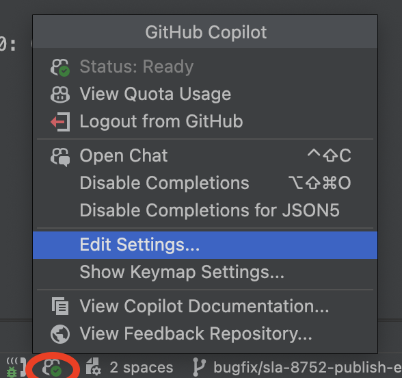
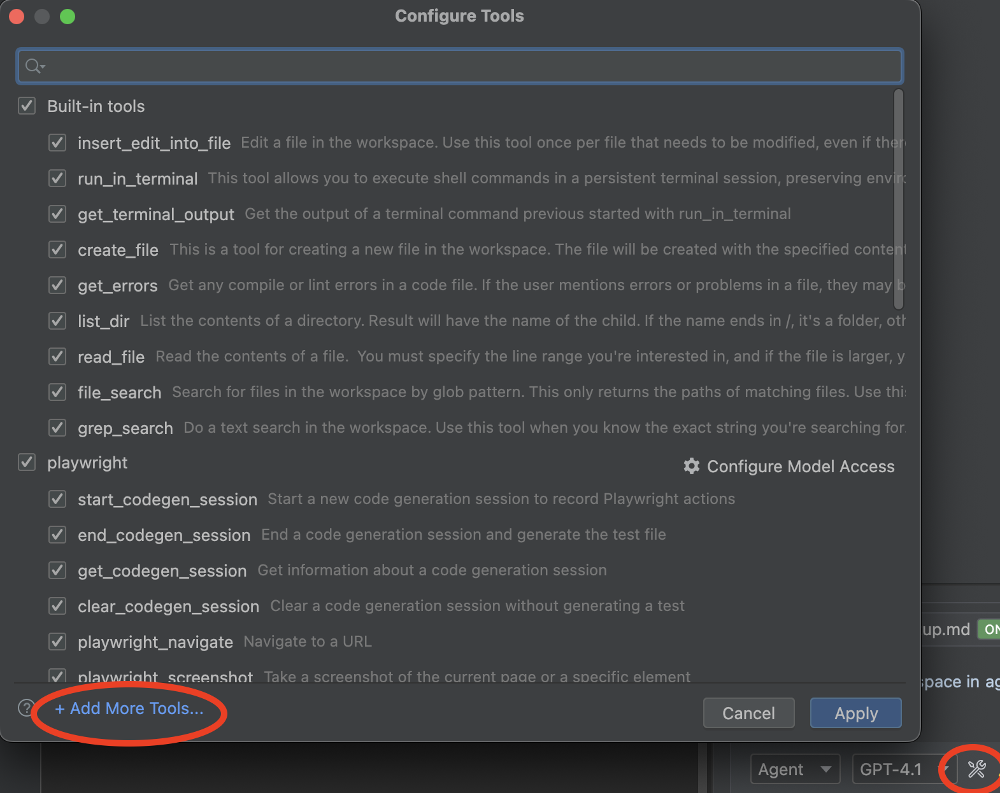

# How to Set Up PHPStorm for Backend Development

## Table of Contents

1. [Install GitHub Copilot Plugin](#1-install-github-copilot-plugin)
2. [AI Configuration for Efficient Development](#2-ai-configuration-for-efficient-development)
   - [AI Rules](#ai-rules)
   - [MCP Servers Setup](#mcp-servers-setup)

## 1. Install GitHub Copilot Plugin

- [Install the PHPStorm plugin](https://plugins.jetbrains.com/plugin/17718-github-copilot)
- Authorize yourself as a GitHub user in the `Preferences->Languages and Frameworks-> GitHub Copilot`:

- To ensure that GitHub Copilot is installed, you can right-click in PHPStorm, see the GitHub Copilot option in the context menu and its features, as shown in the screenshot below:

## 2. AI Configuration for Efficient Development

### AI Rules

- Click on the GitHub Copilot icon at the bottom and choose `Edit Settings`.

- Go to `Customizations`, here you can set up `Global` and `Workspace` instructions and also add specific instruction files for different tasks.

- **Use rules from this prompt library as a base**: You can find ready-to-use AI rules in the [`rules/`](../rules/) directory of this repository. These rules can be:
  - Combined in one file and added as either Global or Workspace instructions depending on their scope
  - Used individually as instruction files for specific file types or development scenarios
  - Mixed and matched based on your project needs

**Custom Instructions**

- **Global Instructions**: Add rules that can be applicable for all projects you're working on. These are applied across all workspaces.
  
- **Workspace Instructions**: Add rules specific to the current project only. These are applied only to the current workspace. 

- **Instruction Files**: Use these for rules that should be applied in specific cases. For example:
  - Specific rules for writing `.twig` files or `.ts` files
  - For the prompt library, cypress-specific rules can be placed here

### MCP Servers Setup

There are two options on how to configure MCP server for PHPStorm + GitHub Copilot.

1. **Use GitHub Copilot Settings**:
   
   - Click on the GitHub Copilot icon at the bottom and choose `Edit Settings`.
   - Go to `Model Context Protocol (MCP)` and click `Configure` button.
   
   

2. **Use Configure Tools in Chat**:
   
   - Click on `Configure tools` button in the chat.
   
   

The file with MCP configuration will be opened, you can start MCP server from here, adjust configuration or add another one.

