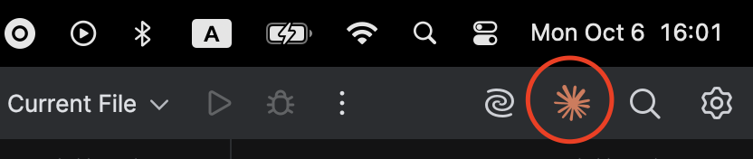

# How to setup Claude Code for development

## Table of Contents

- [Before you begin](#before-you-begin)
- [Step 1: Install Claude Code](#step-1-install-claude-code)
- [Step 2: Log in to your account](#step-2-log-in-to-your-account)
- [Step 3: Start your first session](#step-3-start-your-first-session)
- [Common workflows](#common-workflows)
- [AI Rules](#ai-rules)
- [Essential commands](#essential-commands)
- [Getting help](#getting-help)

This quickstart guide will have you using AI-powered coding assistance in just a few minutes. By the end, you'll understand how to use Claude Code for common development tasks.

## Before you begin

Make sure you have:

* A [Claude.ai](https://claude.ai) (recommended) or [Claude Console](https://console.anthropic.com/) account

## Step 1: Install Claude Code

### NPM Install

If you have [Node.js 18 or newer installed](https://nodejs.org/en/download/):

```sh
npm install -g @anthropic-ai/claude-code
```

## Step 2: Log in to your account

Claude Code requires an account to use. When you start an interactive session with the `claude` command, you'll need to log in:

```bash
claude
# You'll be prompted to log in on first use
```

```bash
/login
# Follow the prompts to log in with your account
```

You can log in using either account type:

* [Claude.ai](https://claude.ai) (subscription plans - recommended)
* [Claude Console](https://console.anthropic.com/) (API access with pre-paid credits)

Once logged in, your credentials are stored and you won't need to log in again.

When you first authenticate Claude Code with your Claude Console account, a workspace called "Claude Code" is automatically created for you. This workspace provides centralized cost tracking and management for all Claude Code usage in your organization.

## Step 3: Start your first session

Open your terminal in any project directory and start Claude Code:

```bash
cd /path/to/your/project
claude
```

You'll see the Claude Code welcome screen with your session information, recent conversations, and latest updates. Type `/help` for available commands or `/resume` to continue a previous conversation.

After logging in (Step 2), your credentials are stored on your system. Learn more in [Credential Management](https://docs.claude.com/en/docs/claude-code/iam#credential-management).

### Use plugins (recommended)
Jetbrains IDE \[beta]: https://marketplace.visualstudio.com/items?itemName=anthropic.claude-code

VS Code: https://marketplace.visualstudio.com/items?itemName=anthropic.claude-code

In PhpStorm you will see claude button in the top right corner. Click it and start coding with AI.



In VS Code it will be the same.

## Common workflows

**Write code**

```
> Provide dependencies that I use in @SomeBusinessModelFile to @ModuleFolder and create factory methods.
```

**Refactor code**

```
> refactor the authentication module to use async/await instead of callbacks
```

**Write tests**

```
> write unit tests for the calculator functions
```

**Code review**

```
> review my changes and suggest improvements
```

**Git**

```
> commit my changes with a descriptive message
```

## AI Rules
Create CLAUDE.md file in your project root and write your rules there.

## Essential commands

Here are the most important commands for daily use:

| Command             | What it does                      | Example                             |
| ------------------- | --------------------------------- | ----------------------------------- |
| `claude`            | Start interactive mode            | `claude`                            |
| `claude "task"`     | Run a one-time task               | `claude "fix the build error"`      |
| `claude -p "query"` | Run one-off query, then exit      | `claude -p "explain this function"` |
| `claude -c`         | Continue most recent conversation | `claude -c`                         |
| `claude -r`         | Resume a previous conversation    | `claude -r`                         |
| `claude commit`     | Create a Git commit               | `claude commit`                     |
| `/clear`            | Clear conversation history        | `> /clear`                          |
| `/help`             | Show available commands           | `> /help`                           |
| `exit` or Ctrl+C    | Exit Claude Code                  | `> exit`                            |

See the [CLI reference](/en/docs/claude-code/cli-reference) for a complete list of commands.

## Getting help

* **Official documentation**: [Claude Code documentation](https://docs.claude.com/en/docs/claude-code/overview)
* **In Claude Code**: Type `/help` or ask "how do I..."
* **Community**: Join our [Discord](https://www.anthropic.com/discord) for tips and support
* **Install MCP servers**: https://docs.claude.com/en/docs/claude-code/mcp#installing-mcp-servers
