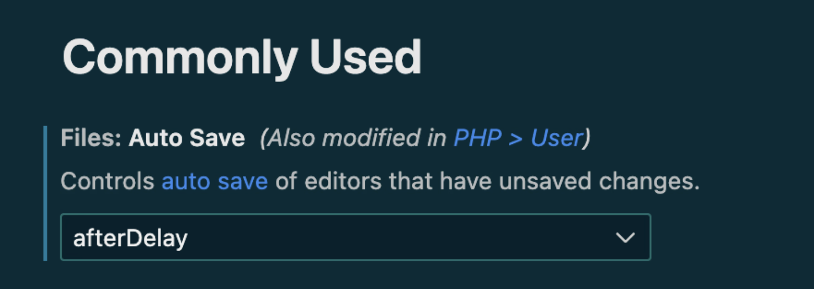
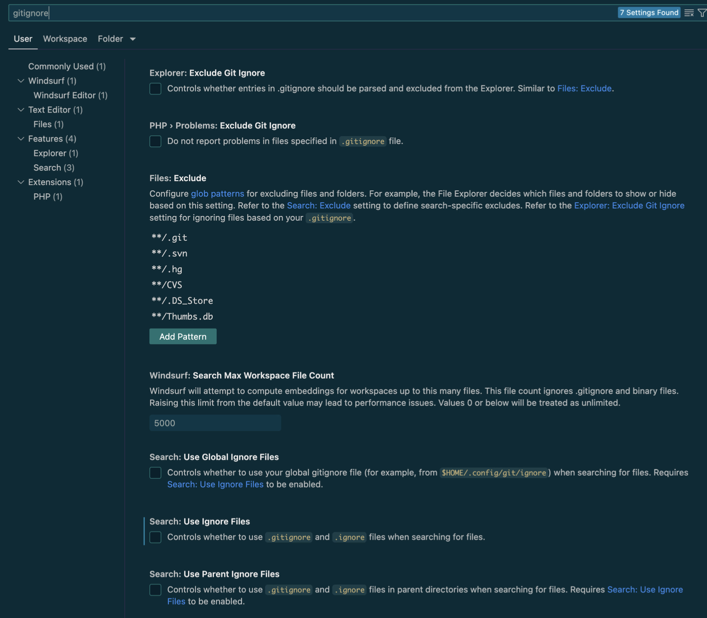
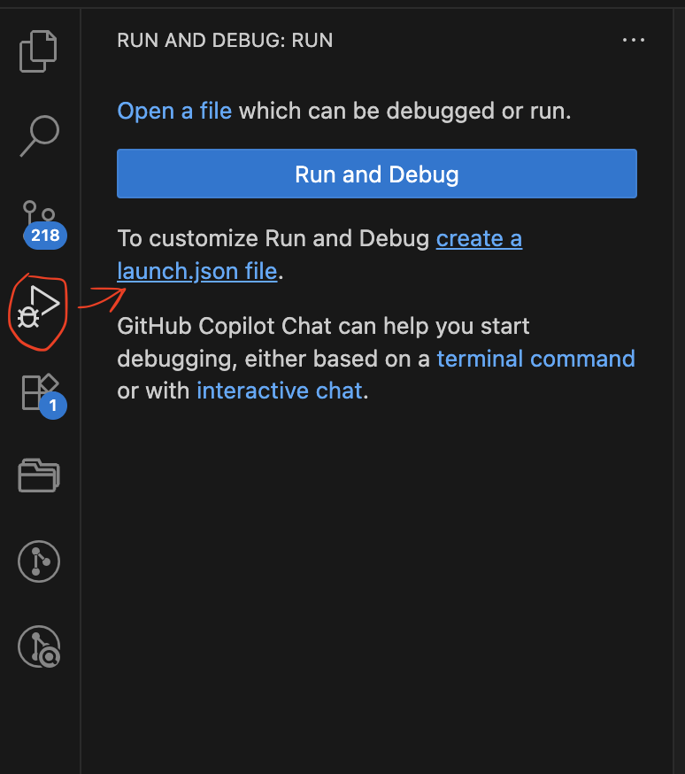
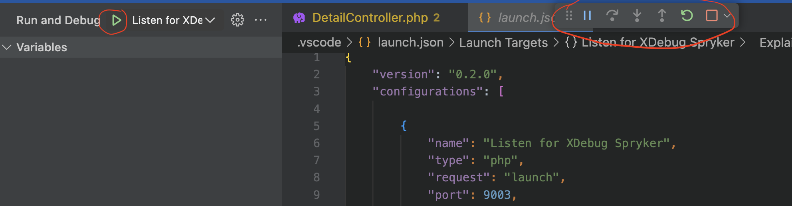
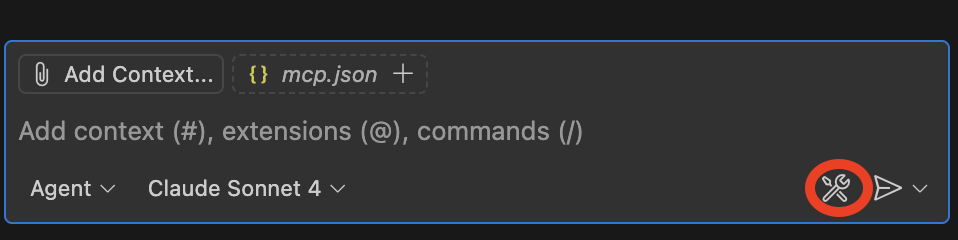
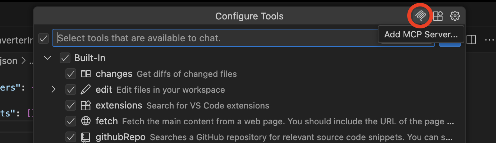
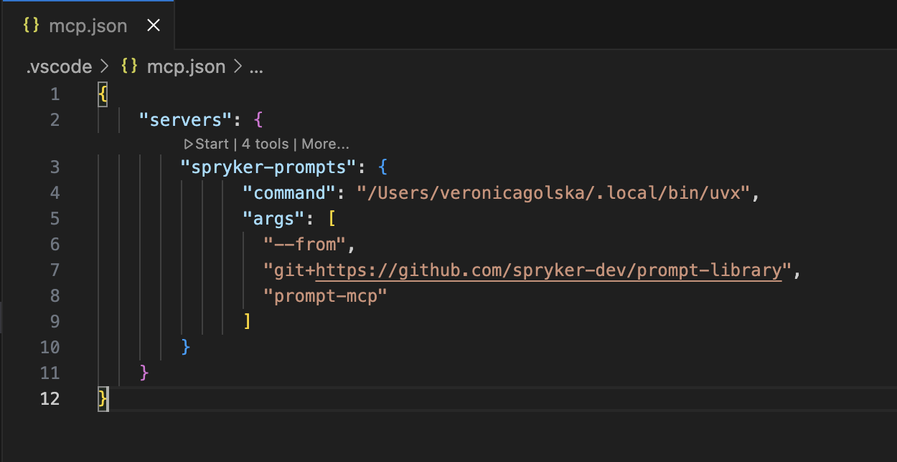

# How to Set Up VS Code for Backend Development

This guide helps you configure VS Code for local development.
If you want to integrate Prompt library, please check [Readme](README.md) first, since some sections of this document might not be needed.

## Table of Contents

1. [Install VS Code](#1-install-vs-code)
2. [Install Recommended Extensions](#2-install-recommended-extensions)
   - [Development](#development)
   - [Git & Database](#git--database)
   - [Familiar Shortcuts](#familiar-shortcuts)
3. [Configure Basic Options](#3-configure-basic-options)
4. [Set Up PHP Debugging](#4-set-up-php-debugging)
5. [AI Configuration for Efficient Development](#5-ai-configuration-for-efficient-development)
   - [AI Rules](#ai-rules)
   - [MCP Servers Setup](#mcp-servers-setup)

## 1. Install VS Code

**VS Code**: https://code.visualstudio.com/

For VS Code, also install:
• GitHub Copilot: https://marketplace.visualstudio.com/items?itemName=GitHub.copilot
• GitHub Copilot Chat: https://marketplace.visualstudio.com/items?itemName=GitHub.copilot-chat

## 2. Install Recommended Extensions

### Development

- **PHP Tools** - https://marketplace.visualstudio.com/items?itemName=DEVSENSE.phptools-vscode
- **PHP Debug** - https://marketplace.visualstudio.com/items?itemName=felixfbecker.php-debug
- **PHP Intelephense** - https://marketplace.visualstudio.com/items?itemName=bmewburn.vscode-intelephense-client
- **Twig** - https://marketplace.visualstudio.com/items?itemName=mblode.twig-language-2
- **Cypress** - https://marketplace.visualstudio.com/items?itemName=shevtsov.vscode-cy-helper
- **XML** - https://marketplace.visualstudio.com/items?itemName=DotJoshJohnson.xml

### Git & Database

- **GitLens** - https://marketplace.visualstudio.com/items?itemName=eamodio.gitlens
- **GitHub Pull Requests** - https://marketplace.visualstudio.com/items?itemName=GitHub.vscode-pull-request-github
- **MySQL Client** - https://marketplace.visualstudio.com/items?itemName=cweijan.vscode-mysql-client2

### Familiar Shortcuts

- **IntelliJ Keybindings** - https://marketplace.visualstudio.com/items?itemName=k--kato.intellij-idea-keybindings

## 3. Configure Basic Options

1. Enable autosave:



2. Enable indexing of files present in .gitignore (remove all check marks):



***If you face any issues with indexing files inside the vendor folder, removing "**/.git" pattern may also be an option.**

## 4. Set Up PHP Debugging

1. Go to `Run and Debug` section and create a `.vscode/launch.json` configuration file:



2. Add the following debug configurations:

```json
{
    "version": "0.2.0",
    "configurations": [
        {
            "name": "Listen for Xdebug",
            "type": "php",
            "request": "launch",
            "port": 9003,
            "runtimeExecutable": "/absolute/path/php/bin",
            "pathMappings": {
                "/data": "${workspaceFolder}"
            },
            "log": true,
            "xdebugSettings": {
                "max_data": 65535,
                "show_hidden": 1,
                "max_children": 100,
                "max_depth": 5
            }
        }
    ]
}
```

3. To start a debug session, you need to press the green Play button, and when the session is started, you can see this panel as in the image:



## 5. AI Configuration for Efficient Development

### AI Rules

Create a `.github/copilot-instructions.md` file in your project root:

In this file, you should:
- Provide Spryker-specific context and coding guidelines
- Configure project requirements and development patterns
- **Use rules from this prompt library as a base**: You can find ready-to-use AI rules in the [`rules/`](../rules/) directory of this repository

Documentation: https://docs.github.com/en/copilot/how-tos/configure-custom-instructions/add-repository-instructions

### MCP Servers Setup

There are two options on how to configure MCP server for VS Code + GitHub Copilot.

1. Configure with GitHub Copilot
   1. Click Configure Tools button in GitHub Copilot chat
   
   
   
   2. Then click Add MCP Server button
   
   
   
   3. Select the type of MCP server and specify where to install it - either Global or Workspace, depending on where you need it to be available.
   4. The file with MCP configuration will be opened, you can start MCP server from here, adjust configuration or add another one.
   
   

2. Another option to set up the MCP server is to manually create mcp.json in the `.vscode` directory and insert the config. This MCP server will be available within your current workspace.

For additional information, please see the [official documentation](https://docs.github.com/en/copilot/how-tos/provide-context/use-mcp/extend-copilot-chat-with-mcp).
